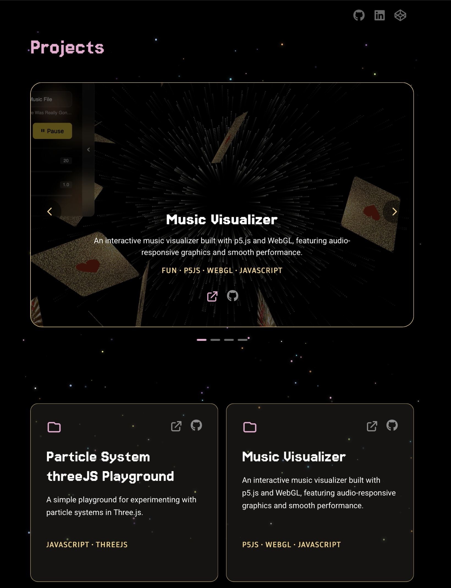

# Damaris Poppe - Portfolio Website

> A dynamic, responsive portfolio website that automatically showcases GitHub repositories through GitHub's GraphQL API. Built with vanilla JavaScript and modern web technologies, featuring an interactive project carousel and animated UI elements.

## Live Demo
[View Portfolio](https://damarisc.netlify.app)




## ✨ Features

- **Dynamic GitHub Integration**: Automatically fetches and displays pinned repositories and projects tagged with 'fun'
- **Interactive Project Carousel**: Spotlight carousel showcasing pinned repositories with auto-slide functionality
- **Responsive Design**: Mobile-first approach with desktop-optimized navigation
- **Animated UI**: Custom intro fading animation, sparkles background effect, and smooth transitions
- **Repository Management**: image handling from API response for project previews in carousel
- **Modern Tech Stack Display**: Topics from GitHub repositories automatically displayed as tech stack badges

**Skills:**
- Modern JavaScript (ES6+, Classes, Modules, Async/Await)
- API Integration (REST & GraphQL)
- Serverless Functions
- Component Architecture
- Responsive Web Design
- CSS Animations & Transitions
- Git Version Control
- Deployment & DevOps
- Documentation & Project Management

## 🛠 Technologies Used

### Frontend
- **HTML5**: Semantic structure
- **CSS3**: Custom animations and responsive design
- **Vanilla JavaScript (ES6+)**: Modern JavaScript with modules, classes, and async/await
- **Tailwind CSS**: Utility-first CSS framework for rapid styling

### Backend & APIs
- **Netlify Functions**: Serverless functions for GitHub API integration
- **GitHub GraphQL API**: Fetching repository data, pinned items, and metadata
- **GitHub REST API**: Repository content fetching for custom images

### Development Tools
- **Node.js**: Development environment
- **npm**: Package management
- **Netlify Dev**: Local development server
- **Concurrently**: Running multiple development tasks

### Architecture Patterns
- **Component-Based Architecture**: Modular JavaScript classes for UI components
- **Object-Oriented Programming**: Repository, Project, and FunProject classes with inheritance
- **Async/Await Pattern**: Modern asynchronous JavaScript for API calls
- **ES6 Modules**: Import/export system for code organization

## 📁 Project Structure

```
portfolio/
├── index.html                     # Main HTML file
├── package.json                   # Dependencies and scripts
├── tailwind.config.js            # Tailwind CSS configuration
├── netlify/
│   └── functions/                # Serverless functions
│       ├── config.cjs            # Shared configuration
│       ├── get-pinned-repos.cjs  # Fetch pinned repositories
│       └── get-all-repos.cjs     # Fetch all repositories
├── src/
│   ├── js/
│   │   ├── main.js               # Application entry point
│   │   ├── config/
│   │   │   └── app-config.js     # Client-side configuration
│   │   └── components/           # Reusable UI components
│   │       ├── repository.js     # Base repository class
│   │       ├── project.js        # Project component with carousel
│   │       ├── fun.js            # Fun projects component
│   │       ├── hero.js           # Hero section component
│   │       ├── nav.js            # Navigation component
│   │       ├── footer.js         # Footer component
│   │       ├── intro.js          # Intro animation component
│   │       └── sparkles.js       # Background sparkles effect
│   ├── styles/
│   │   └── styles.css            # Custom CSS and Tailwind imports
│   └── assets/
│       ├── images/               # Static images
│       └── *.gif, *.svg          # Animation assets
└── dist/                         # Built assets
    └── styles.css                # Compiled Tailwind CSS
```

## 🔧 Setup Instructions

### Prerequisites
- Node.js (v14 or higher)
- npm or yarn
- GitHub account
- Netlify account (for deployment)

### Local Development

1. **Clone the repository**
   ```bash
   git clone https://github.com/your-username/portfolio.git
   cd portfolio
   ```

2. **Install dependencies**
   ```bash
   npm install
   ```

3. **Set up environment variables**
   Create a `.env` file in the root directory:
   ```bash
   MY_GITHUB_TOKEN=your_github_personal_access_token
   ```

4. **Generate GitHub Personal Access Token**
   - Go to GitHub Settings > Developer settings > Personal access tokens
   - Generate a new token with the following scopes:
     - `public_repo`
     - `read:user`
   - Copy the token to your `.env` file

5. **Start development server**
   ```bash
   npm run dev
   ```
   This runs Tailwind CSS watcher and Netlify Dev concurrently (see package.json)

6. **Build for production**
   ```bash
   npm run build
   ```

### GitHub Repository Setup

For optimal display in your portfolio, configure your GitHub repositories as follows:

#### Repository Images
Add project preview images to each repository.
- Caroussel is only displaying one image (see project.js). Sapp-config.js  
```
your-repo/
├── images/
│   ├── display1.png    # Primary carousel image (recommended: 1200x600px)
│   └── display1.jpg     # Alternative names of image file, Caroussel is only displaying one (see project.js)
└── README.md
```

#### Repository Details
Edit each repository's details on GitHub:
- **Description**: Brief project description (displayed in cards)
- **Website**: Live demo URL (used for demo links)
- **Topics**: Tech stack tags (e.g., `javascript`, `react`, `nodejs`)

#### Special Tags
- Add `fun` topic to repositories you want displayed in the "Fun Projects" section
- Pin up to 6 repositories to feature them in the main carousel

### Deployment

#### Netlify Deployment
1. **Connect to Netlify**
   - Link your GitHub repository to Netlify
   - Set build command: `npm run build`
   - Set publish directory: `dist`

2. **Configure Environment Variables**
   Add `MY_GITHUB_TOKEN` in Netlify's environment variables section

3. **Deploy**
   Netlify will automatically deploy on each push to the main branch

## 🎨 Customization

### Personal Configuration
Edit `src/js/config/app-config.js` to customize your portfolio:
```javascript
export const config = {
    personal: {
        name: 'Your Name',                          // Display name
        tagline: 'Your Professional Title',         // Subtitle under name
        profileImage: './path/to/your/image.jpg',   // Hero section image
        footerGif: 'src/assets/girl.gif'           // Footer animation
    },
    social: {
        links: [
            { platform: "Github", link: "https://github.com/yourusername" },
            { platform: "Linkedin", link: "https://linkedin.com/in/yourprofile" },
            { platform: "Codepen", link: "https://codepen.io/yourprofile" }
            // Add more social platforms as needed
        ]
    },
    navigation: {
        links: [
            { text: 'Projects', page: '#projects' }    // Add more nav sections
            // { text: 'About', page: '#about' }       // Uncomment to add sections
        ]
    },
    filters: {
        funProjectTag: 'fun'                        // Tag to filter fun projects
    }
};
```

**Configuration Options:**
- **Social Links**: Supports any FontAwesome brand icon (github, linkedin, codepen, twitter, etc.)
- **Navigation**: Add more sections by uncommenting or adding new links
- **Fun Project Tag**: Change from 'fun' to any custom tag you prefer
- **Profile Image**: Use relative paths from the index.html location

### Styling
- Modify colors in `tailwind.config.js`
- Add custom CSS in `src/styles/styles.css`
- Component-specific styles are scoped within each component class

### GitHub Configuration
Edit `netlify/functions/config.cjs`:
```javascript
const config = {
    github: {
        username: 'your-github-username',
        imagePaths: ['images/display1.png', 'images/preview.png'],
        defaultBranch: 'main'
    }
    // ... other settings
};
```

## 🏗 Architecture Details

### Component System
The application uses a class-based component architecture:

- **Repository**: Base class for all GitHub repositories
- **Project**: Extends Repository, handles pinned repos and carousel functionality  
- **FunProject**: Extends Repository, displays projects tagged with 'fun'
- **Hero**: Landing section with animated profile image
- **Nav**: Responsive navigation with social links
- **Sparkles**: Animated background effect

### API Integration
- **Serverless Functions**: Netlify Functions handle GitHub API calls
- **GraphQL Queries**: Efficient data fetching for repository metadata
- **REST API**: Used for fetching repository images
- **CORS Handling**: Proper cross-origin request management

### Performance Optimizations
- **Lazy Loading**: Components render on demand
- **Fragment-based DOM Manipulation**: Efficient DOM updates
- **CSS Transitions**: Hardware-accelerated animations
- **Modular Loading**: Code splitting through ES6 modules

## 🔒 Security Features
- Environment variable protection for API tokens
- Input sanitization for dynamic content
- Secure API endpoint handling

## 📱 Browser Support
- Modern browsers (Chrome, Firefox, Safari, Edge)
- Mobile-responsive design

## 🤝 Contributing
1. Fork the repository
2. Create a feature branch (`git checkout -b feature/amazing-feature`)
3. Commit your changes (`git commit -m 'Add some amazing feature'`)
4. Push to the branch (`git push origin feature/amazing-feature`)
5. Open a Pull Request

## 📄 License
This project is open source and available under the [MIT License](LICENSE).

---
